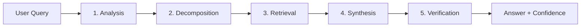

# 🤖 Agentic RAG System

**An intelligent document Q&A system powered by AI agents with multi-step reasoning, advanced retrieval techniques, and comprehensive error handling.**

[](https://www.python.org/downloads/)
[](https://streamlit.io/)
[](LICENSE)

**💡 Live Demo:** Upload documents → Ask questions → Get intelligent answers with source citations

---

## ✨ Features

### 🎯 Core Capabilities
✅ **Multi-Format Document Support** - PDF, DOCX, PPTX, Excel, TXT  
✅ **Agentic Workflow** - 5-step intelligent reasoning process  
✅ **Vector Database** - ChromaDB for semantic search  
✅ **LLM Integration** - Google Gemini 2.5 Flash  
✅ **Clean UI** - Streamlit-based conversational interface  

### 🎁 **Bonus Features** (Advanced Implementation)
⭐ **Advanced Retrieval Techniques**
- Query Expansion (generates alternative phrasings)
- Hybrid Search (BM25 + Vector semantic search)
- MMR Reranking (Maximal Marginal Relevance for diversity)
- Smart Strategy Selection (auto/hybrid/vector/bm25)

⭐ **Comprehensive Error Handling**
- Custom exception types for different error scenarios
- Graceful degradation with fallback strategies
- Detailed logging to `agentic_rag.log`
- User-friendly error messages
- Retry mechanism with exponential backoff

⭐ **Session Management**
- Track uploaded documents per session
- Auto-remove temporary documents
- Clean database management

### 🤖 Agentic Workflow (5 Steps)



1. **Query Analysis** - Understand user intent and complexity
2. **Query Decomposition** - Break complex queries into sub-queries
3. **Intelligent Retrieval** - Multi-strategy document search
4. **Answer Synthesis** - Generate comprehensive, structured answers
5. **Self-Verification** - Validate answer quality and confidence

---

## 🏗️ System Architecture

```
┌──────────────────────────────────────────────────────────┐
│                    Streamlit UI                          │
│              (Chat Interface + Controls)                 │
└────────────────────┬─────────────────────────────────────┘
                     │
                     â–¼
┌──────────────────────────────────────────────────────────┐
│                  Agentic RAG Engine                      │
│  ┌──────────────────────────────────────────────────┐   │
│  │  1. Query Analysis      → Intent Recognition     │   │
│  │  2. Query Decomposition → Sub-query Generation   │   │
│  │  3. Advanced Retrieval  → Hybrid Search         │   │
│  │  4. Answer Synthesis    → Context Integration    │   │
│  │  5. Self-Verification   → Confidence Scoring    │   │
│  └──────────────────────────────────────────────────┘   │
└─────────┬────────────────────────────┬───────────────────┘
          │                            │
          â–¼                            â–¼
   ┌──────────────┐           ┌──────────────────┐
   │  Google      │           │  Vector Database │
   │  Gemini      │           │    (ChromaDB)    │
   │  2.5 Flash   │           │  + BM25 Index    │
   └──────────────┘           └────────┬─────────┘
                                       │
                                       â–¼
                              ┌─────────────────────┐
                              │ Document Processor  │
                              │  PDF│DOCX│PPTX│XL  │
                              └─────────────────────┘
```

**Key Components:**
- **app.py** - Streamlit frontend with error handling
- **agentic_rag.py** - Core agentic workflow engine
- **advanced_retrieval.py** - Bonus: Query expansion, hybrid search, MMR
- **error_handler.py** - Bonus: Comprehensive error management
- **document_processor.py** - Multi-format document ingestion
- **vector_db.py** - ChromaDB wrapper with session management

---

## 🚀 Quick Start

### Prerequisites
- **Python 3.8+** (tested on 3.11.9)
- **Google Gemini API Key** - [Get it FREE here](https://makersuite.google.com/app/apikey)

### Installation (3 steps)

**1️⃣ Clone & Navigate**
```bash
git clone https://github.com/P-Saroha/AI-Agent-documents.git
cd AI-Agent-documents
```

**2️⃣ Setup Virtual Environment**
```bash
# Create virtual environment
python -m venv venv

# Activate it
venv\Scripts\activate          # Windows
source venv/bin/activate       # Linux/Mac
```

**3️⃣ Install Dependencies**
```bash
pip install -r requirements.txt
```

### Configuration

Create a `.env` file in the project root:
```env
GOOGLE_API_KEY=your_actual_gemini_api_key_here
```

**💡 Tip:** Never commit your `.env` file (already in `.gitignore`)

### Run the Application

```bash
streamlit run app.py
```

🎉 **App opens at:** http://localhost:8501

---

## � Usage Guide

### Step-by-Step Walkthrough

**1. Initialize System** 🔑
```
✓ API key auto-loaded from .env
✓ System initialized!
```

**2. Upload Documents** 📄
- Sidebar → "Choose files"
- Select: PDF, DOCX, PPTX, Excel, or TXT
- Click "Process Documents"
- Wait for: `✓ Successfully processed N documents (X chunks)`

**3. Ask Questions** 💬
```
💭 Type: "What are the main fine-tuning techniques discussed?"

🤖 Agent Processing:
  → Analyzing query intent...
  → Breaking into sub-queries...
  → Retrieving relevant chunks...
  → Synthesizing answer...
  → Verifying quality (Confidence: 95%)

📝 Answer displayed with:
  ✓ Comprehensive response
  ✓ Source citations
  ✓ Agent analysis (expandable)
```

**4. Explore Bonus Features** âš¡
- Toggle "Advanced Mode" → Enable hybrid search
- Select strategy: `auto` | `hybrid` | `vector` | `bm25`
- Enable "Session Mode" → Auto-cleanup temporary docs

### Example Queries

| Query Type | Example |
|------------|---------|
| **Summary** | "Give me a summary of this document" |
| **List** | "What fine-tuning techniques are discussed?" |
| **Explain** | "Explain the transformer architecture" |
| **Compare** | "What's the difference between LoRA and QLoRA?" |
| **Details** | "How does the attention mechanism work?" |

---

## 🛠️ Technology Stack

| Component | Technology | Purpose |
|-----------|-----------|---------|
| **🤖 LLM** | Google Gemini 2.5 Flash | Natural language understanding & generation |
| **📊 Vector DB** | ChromaDB | Persistent vector storage & semantic search |
| **🔤 Embeddings** | HuggingFace all-MiniLM-L6-v2 | CPU-optimized text embeddings (80MB) |
| **🔍 Keyword Search** | BM25 (rank-bm25) | **BONUS:** Hybrid retrieval |
| **🧩 Framework** | LangChain | RAG pipeline orchestration |
| **🎨 UI** | Streamlit 1.54+ | Interactive web interface |
| **📄 Parsing** | pypdf, python-docx, python-pptx, openpyxl | Multi-format document support |
| **🛡️ Error Handling** | Custom framework | **BONUS:** Comprehensive error management |

### Dependencies

```txt
# Core
streamlit==1.54.0
langchain-google-genai
chromadb
sentence-transformers

# Advanced Features (Bonus)
rank-bm25              # Hybrid search
logging                # Error tracking

# Document Processing  
pypdf, python-docx, python-pptx, openpyxl, pandas
```

---

## 📁 Project Structure

```
AI-Agent-documents/
│
├── 📱 Frontend
│   └── app.py                      # Streamlit UI with error handling
│
├── 🧠 Core Engine
│   ├── agentic_rag.py              # 5-step agentic workflow
│   ├── document_processor.py       # Multi-format ingestion
│   └── vector_db.py                # ChromaDB wrapper + session mgmt
│
├── 🎁 Bonus Features
│   ├── advanced_retrieval.py       # Query expansion, hybrid search, MMR
│   └── error_handler.py            # Custom exceptions, logging, retry
│
├── 📄 Configuration
│   ├── requirements.txt            # Python dependencies
│   ├── .env                        # API keys (not in git)
│   └── .gitignore                  # Git ignore rules
│
├── 📚 Documentation
│   ├── README.md                   # This file
│   └── SYSTEM_DESIGN.md            # Architecture & design decisions
│
├── 📂 Data
│   ├── sample_data/                # Sample test documents
│   │   ├── ai_overview.txt
│   │   └── machine_learning.txt
│   ├── uploads/                    # User uploads (auto-created)
│   └── chroma_db/                  # Vector database (auto-created)
│
└── 📝 Logs
    └── agentic_rag.log             # Application logs (auto-created)
```

**Core Files Explained:**

| File | Lines | Purpose |
|------|-------|---------|
| `app.py` | ~430 | Main application, UI, session management |
| `agentic_rag.py` | ~290 | Agentic workflow orchestration |
| `advanced_retrieval.py` | ~280 | **BONUS:** Advanced retrieval techniques |
| `error_handler.py` | ~220 | **BONUS:** Error handling framework |
| `document_processor.py` | ~155 | Multi-format document parsing |
| `vector_db.py` | ~150 | ChromaDB operations |

**Total:** ~2,500 lines of code

---

---

## 🔧 Advanced Configuration

### Bonus Features Activation

**Enable Advanced Retrieval:**
```python
# In UI: Toggle "âš¡ Enable Advanced Mode"
# Provides: Query expansion, hybrid search, MMR reranking
```

**Retrieval Strategies:**
- `auto` - Smart selection based on query type (recommended)
- `hybrid` - Best performance (BM25 + Vector search)
- `vector` - Pure semantic search
- `bm25` - Pure keyword search

**Session Mode:**
- Track documents uploaded in current session
- Click "Done (Remove)" to auto-cleanup
- Keeps database clean without manual management

### Customization

**Chunking Strategy** (`document_processor.py`):
```python
chunk_size = 1000        # Characters per chunk
chunk_overlap = 200      # Overlap for context continuity
```

**LLM Settings** (`app.py`):
```python
model = "gemini-2.5-flash"
temperature = 0.3         # Lower = more focused, higher = more creative
```

**Retrieval Configuration** (`agentic_rag.py`):
```python
num_results = 8           # Documents per sub-query
max_chunks = 10           # Chunks for answer synthesis
```

---

## 🐛 Troubleshooting

| Issue | Solution |
|-------|----------|
| ❌ **API Key Error** | • Verify key is correct<br>• Check no extra spaces in `.env`<br>• Generate new key if expired |
| ⚠️ **"No module named..."** | • Activate virtual environment<br>• Run `pip install -r requirements.txt` |
| 📄 **"No content extracted"** | • Check file format is supported<br>• Verify file isn't corrupted<br>• Try different document |
| 🐌 **Slow Processing** | • Large PDFs take time<br>• Enable advanced mode for better results<br>• Check internet for API calls |
| 💾 **Database Errors** | • Click "Clear All" in sidebar<br>• Delete `chroma_db/` folder<br>• Restart application |
| 🔍 **Poor Retrieval Quality** | • Enable "Advanced Mode"<br>• Use "hybrid" strategy<br>• Upload more relevant documents |

### Logs & Debugging

Check `agentic_rag.log` for detailed error traces:
```bash
tail -f agentic_rag.log  # Live monitoring
```

---

## 📊 Performance & Limitations

### Performance Metrics
- **Document Processing:** ~5-10 seconds for typical PDF (20 pages)
- **Query Response:** 3-8 seconds depending on complexity
- **Embedding Model:** ~80MB (cached locally after first use)
- **Memory Usage:** ~500MB RAM for typical workload

### Known Limitations

| Limitation | Impact | Workaround |
|------------|--------|------------|
| **API Rate Limits** | 60 requests/min (free tier) | Use smaller queries |
| **Context Window** | ~30K tokens max | Split very large docs |
| **Language** | Optimized for English | May work with other languages |
| **File Size** | Best < 50MB per doc | Split large files |
| **Accuracy** | Depends on doc quality | Use clean, well-formatted docs |

---

## 🔄 Future Enhancements

- [ ] Support for more document types (CSV, JSON)
- [ ] Advanced retrieval techniques (HyDE, Multi-query)
- [ ] Conversation memory across sessions
- [ ] Document summarization feature
- [ ] Export chat history
- [ ] Milvus integration option
- [ ] Self-hosted LLM support

## 📝 License

This project is open source and available for educational purposes.

## 👥 Contributing

Contributions are welcome! Please feel free to submit pull requests or open issues.

## 📧 Contact

For questions or feedback, please open an issue in the repository.

---

**Built with ❤️ for intelligent document understanding**

<div align="center">

**Built with ❤️ for Intelligent Document Understanding**

⭐ **Star this repo if you found it helpful!**

[](https://github.com/P-Saroha/AI-Agent-documents/stargazers)

**Agentic RAG System** | 2026

</div>
